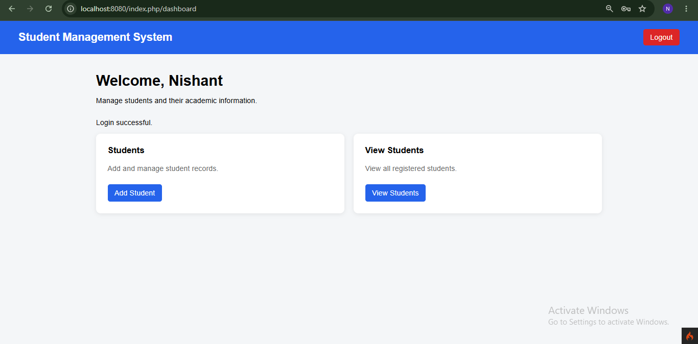
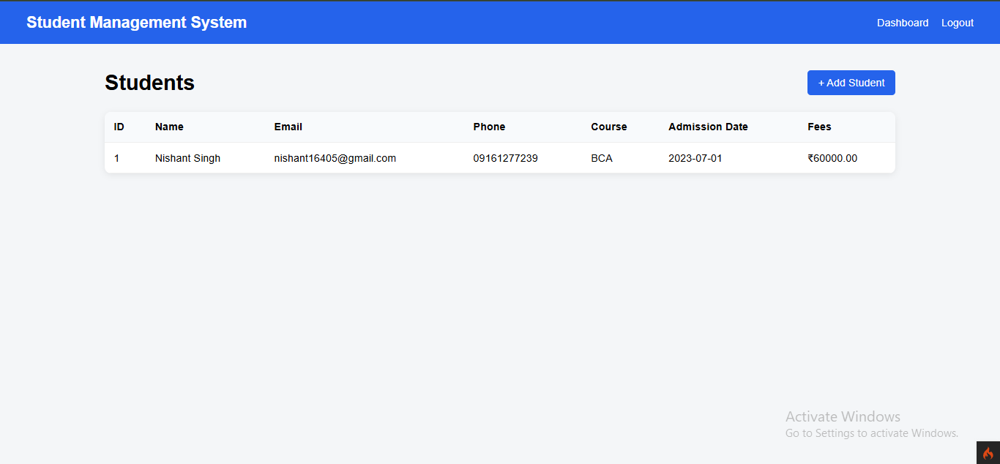

# Student Management System

A web-based **Student Management System** built using **PHP and CodeIgniter 4**. The application provides user authentication and allows authenticated users to manage and view student academic information through a simple and responsive interface.

## 📸 Screenshots

### Dashboard



The dashboard provides access to the main student management functionalities and displays the currently logged-in user.

### Students List



The students page displays registered student information including name, email, phone number, course, admission date, and fees.

---

## 🚀 Features

* User Registration
* User Login and Logout
* Password Hashing
* Session-based Authentication
* Dashboard
* Add Student
* View Students
* Student Information Management
* Form Validation
* MySQL Database Integration
* MVC architecture using CodeIgniter 4

---

## 🛠️ Technologies Used

* **PHP**
* **CodeIgniter 4**
* **MySQL**
* **HTML5**
* **CSS3**
* **Bootstrap**
* **Git & GitHub**

---

## 🏗️ Project Architecture

The project follows the **MVC (Model-View-Controller)** architecture provided by CodeIgniter 4.

```text
Student Management System
│
├── Controllers
│   ├── UserController
│   └── StudentController
│
├── Models
│   ├── UserModel
│   └── StudentModel
│
├── Views
│   ├── login
│   ├── signup
│   ├── dashboard
│   └── students
│
└── Database
    ├── Users
    └── Students
```

---

## ⚙️ Installation & Setup

### 1. Clone the repository

```bash
git clone https://github.com/YOUR-USERNAME/Student-Management-System.git
```

### 2. Navigate to the project

```bash
cd Student-Management-System
```

### 3. Install dependencies

```bash
composer install
```

### 4. Configure the environment

Copy the environment file:

```bash
cp env .env
```

Then configure your database credentials in `.env`.

Example:

```env
database.default.hostname = localhost
database.default.database = student_management
database.default.username = root
database.default.password =
database.default.DBDriver = MySQLi
```

### 5. Create the database

Create a MySQL database named:

```text
student_management
```

Then create the required tables according to the project's database structure.

### 6. Start the application

Run:

```bash
php spark serve
```

The application will be available at:

```text
http://localhost:8080
```

---

## 🔐 Authentication

The application includes:

* User registration
* Secure password hashing using PHP's `password_hash()`
* Login authentication
* Session management
* Logout functionality
* Protected application pages

---

## 📚 Student Management

Authenticated users can access student-related functionality from the dashboard.

Student records contain information such as:

| Field          | Description               |
| -------------- | ------------------------- |
| ID             | Unique student identifier |
| Name           | Student's full name       |
| Email          | Student's email address   |
| Phone          | Contact number            |
| Course         | Academic course           |
| Admission Date | Date of admission         |
| Fees           | Course fees               |

---

## 📂 Project Structure

```text
app/
├── Controllers/
├── Models/
├── Views/
├── Config/
└── Database/

public/
├── index.php
└── assets/

writable/
system/
composer.json
composer.lock
.env
```

> `.env` should not be committed to GitHub because it may contain database credentials or other sensitive configuration.

---

## 🎯 Purpose of the Project

This project was developed to gain practical experience with:

* PHP web development
* CodeIgniter 4 framework
* MVC architecture
* Database integration
* Authentication and sessions
* CRUD-based application development
* Git and GitHub

---

## 👨‍💻 Author

**Nishant Singh**

BCA Graduate | Software Developer

GitHub: https://github.com/T-nahsin
